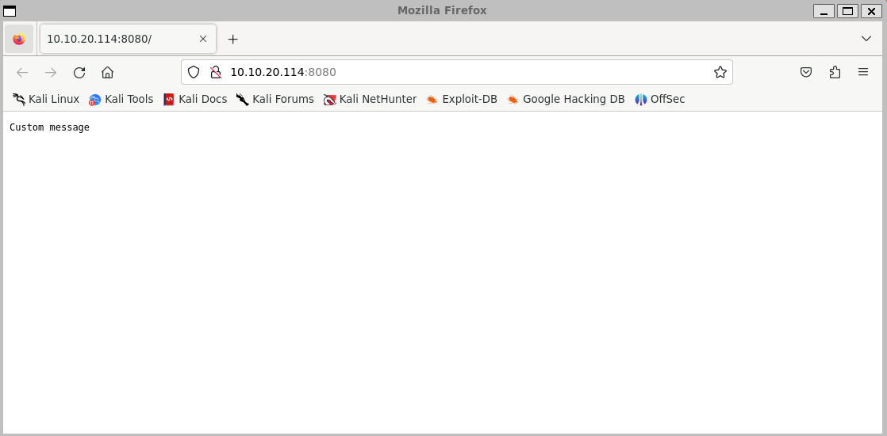

# AoC 2023 - Day 13

> `Intrusion detection` To the Pots, Through the Walls

> The proposed merger and suspicious activities have kept all teams busy and engaged. So that the Best Festival Company's systems are safeguarded in the future against malicious attacks, McSkidy assigns The B Team, led by McHoneyBell, to research and investigate mitigation and proactive security.

## Learning Objectives
> - Learn to understand incident analysis through the Diamond Model.
> - Identify defensive strategies that can be applied to the Diamond Model.
> - Learn to set up firewall rules and a honeypot as defensive strategies.

## Steps

I'm given access to a computer over `ssh`.

```bash
└─$ export box=10.10.20.114
└─$ ssh vantwinkle@$box
```

#### Checking status of the firewall
```bash
vantwinkle@ip-10-10-20-114:~$ sudo ufw status
[sudo] password for vantwinkle:
Status: inactive
```

#### Activating a honeypot

```bash
vantwinkle@ip-10-10-20-114:~$ cd pentbox/pentbox-1.8/
vantwinkle@ip-10-10-20-114:~/pentbox/pentbox-1.8$ ls -la
total 84
drwxr-xr-x 5 vantwinkle vantwinkle  4096 Jun 13  2014 .
drwxrwxr-x 4 vantwinkle vantwinkle  4096 Nov 14 23:48 ..
-rwxr-xr-x 1 vantwinkle vantwinkle 35147 Jun 10  2011 COPYING.txt
-rwxr-xr-x 1 vantwinkle vantwinkle  4928 Jun 13  2014 changelog.txt
drwxr-xr-x 7 vantwinkle vantwinkle  4096 Jun 10  2011 lib
drwxr-xr-x 4 vantwinkle vantwinkle  4096 Jun 10  2011 other
-rwxr-xr-x 1 vantwinkle vantwinkle    85 Jun 10  2011 pb_update.rb
-rwxr-xr-x 1 vantwinkle vantwinkle  7647 Jun 13  2014 pentbox.rb
-rwxr-xr-x 1 vantwinkle vantwinkle    47 Jun 10  2011 readme.txt
-rwxr-xr-x 1 vantwinkle vantwinkle    41 Jun 10  2011 todo.txt
drwxr-xr-x 6 vantwinkle vantwinkle  4096 Jun 10  2011 tools
vantwinkle@ip-10-10-20-114:~/pentbox/pentbox-1.8$ sudo ./pentbox.rb
```

Manual setup using the following (simplified for readability):

```bash
2- Network tools
3- Honeypot
2- Manual Configuration [Advanced Users, more options]

 Insert port to Open.

   -> 8080

 Insert false message to show.

   -> Custom message

 Save a log with intrusions?

 (y/n)   -> y

 Log file name? (incremental)

Default: */pentbox/other/log_honeypot.txt

   ->

 Activate beep() sound when intrusion?

 (y/n)   -> n

  HONEYPOT ACTIVATED ON PORT 8080 (2023-12-17 12:28:45 +0000)
```

#### Testing it out

```bash
└─$ export box=10.10.20.114
└─$ firefox $box:8080
```



```bash
  INTRUSION ATTEMPT DETECTED! from 10.8.214.49:48456 (2023-12-17 12:29:34 +0000)
 -----------------------------
GET / HTTP/1.1
Host: 10.10.20.114:8080
User-Agent: Mozilla/5.0 (X11; Linux x86_64; rv:109.0) Gecko/20100101 Firefox/115.0
Accept: text/html,application/xhtml+xml,application/xml;q=0.9,image/avif,image/webp,*/*;q=0.8
Accept-Language: en-US,en;q=0.5
Accept-Encoding: gzip, deflate
Connection: keep-alive
Upgrade-Insecure-Requests: 1
```

#### Firewall Settings
```bash
vantwinkle@ip-10-10-20-114:~$ sudo nano ./Van_Twinkle_rules.sh
[...]
sudo ufw allow 8090/tcp
[...]
```

```bash
└─$ firefox $box:8090
```

The flag is written under one of the blog posts.

## Question 1

> Which security model is being used to analyse the breach and defence strategies?

Diamond model

## Question 2

> Which defence capability is used to actively search for signs of malicious activity?

Threat hunting

## Question 3

> What are our main two infrastructure focuses? (Answer format: answer1 and answer2)

firewall and honeypot

## Question 4

> Which firewall command is used to block traffic?

deny

## Question 5

> There is a flag in one of the stories. Can you find it?

The flag is written under one of the blog posts.
